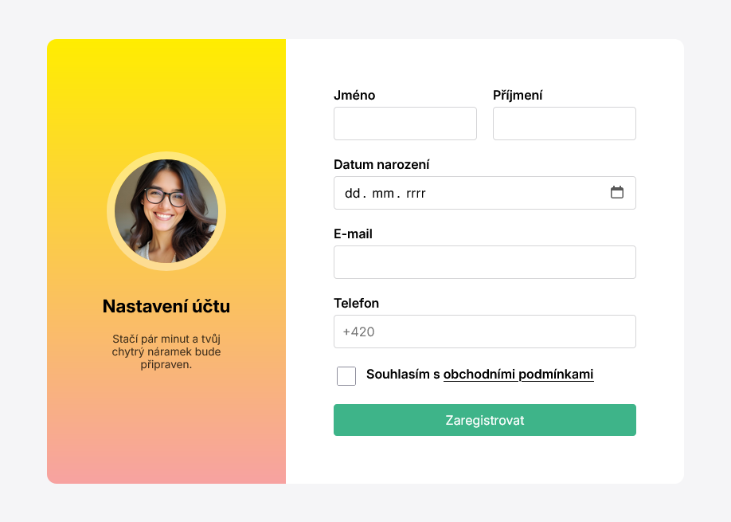

# Projekt: Registrační formulář

*Cvičný projekt pro kurz HTML a CSS (blended) od Czechitas.*

Zapoj svoje designersko-kóderské mozkové závity a nakóduj registrační formulář co nejblíže zadání na obrázku.

## Základní rozměry:

- formulář je šitoký `800px`
- levá polovina má `300px`
- pravá polovina má `500px`
- obě poloviny mají padding `60px`

## Ukázka výsledku

